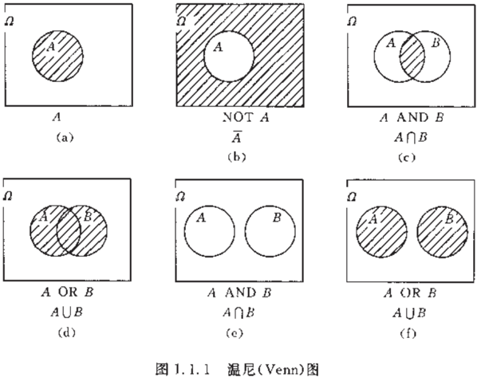
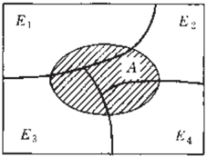

Beauty is our business.

完美是我们的追求。

## 前 言

Edsgar Wybe Dijk stra

埃德斯加·狄克斯特拉

（荷兰计算机科学家，1972年图灵奖获得者）

## 背景

计算机和计算机网络是20世纪人类的伟大创造。当我们跨进21世纪的大门，骞然回 首，发现没有哪个发明像计算机和计算机网络这样对整个人类文明和社会进步发生了和发 生着如此巨大、如此深刻的影响。计算机网络和计算机系统已经成为现代信息社会最重要 的基础设施之一，其应用已遍布社会的各个领域，成为国家发展和社会进步的基本需求，是 知识经济的基本载体和支撑环境。

性能评价（performancecvaluation）是计算机网络和计算机系统研究与应用的重要理论 基础和支撑技术，是通信和计算机科学领域的重要研究方向，也是一门理论与实践紧密相 连、内容丰富、体系完整的学科。在国外，性能评价技术的研究和应用都十分广泛，《PerformanceEvaluation》就是一本专门介绍计算机网络和计算机系统性能评价的国际权威期 刊，许多IEEE的会刊（transactions）也都有专门的PerformanceEvaluation专栏，还有许多 关于性能评价的国际学术年会定期召开。另外，性能评价也是国外计算机、通信、信息科学 等专业大学高年级学生和研究生的必修课程之一。而在国内，性能评价技术的教学与科研 都待加强。

作者从事性能评价方面的研究工作已近20年，并在清华大学计算机科学与技术系讲授 研究生课程"计算机网络和计算机系统的性能评价"，该课程以其理论高度和实践指导意义 受到了清华研究生的欢迎。在讲课的过程中，作者对讲义进行了不断的充实与完善，本书就 是在讲义的基础上写成的。书中取材新颖，并且包含了作者多年来在此领域的大量科学研 究成果，是作者经验的总结。

## 性能评价方法

计算机网络和计算机系统性能评价的目的主要有三个；选择、改进和设计。具体而言， 是指在众多的系统（方案)中选择一个最适合需要的系统（方案），即在一定的价格范围内选 择性能最好的系统，达到较好的性能/价格比；对已有系统的性能缺陷和瓶颈进行改进和提 高其运行效率；对未来设计的系统进行性能预测，在性能成本方面实现最佳设计或配置。

计算机网络和计算机系统的性能一般包括以下两个大的方面：一个方面是它的可靠性

或可利用性，亦即，计算机系统能正常工作的时间，其指标可以是能够持续工作的时间长度， 如平均无故障时间，也可以是在一段时间内，能正常工作的时间所占的百分比。另一方面是 它的处理能力或效率。这又可分为三类指标：一类指标是各种吞吐率，如系统在单位时间内 能处理正常作业的个数。另一类指标是各种响应的时间，即从系统得到输入到给出输出之 间的时间。再一类指标是各种利用率，即在给定的时间区间中，各种部件（包括硬设备和软 系统)被使用的时间与整个时间之比。当然不同的系统对性能指标的描述有所不同，例如网 络常用的性能评估指标为：信道传输速率、信道吞吐量和容量、信道利用率、传输延迟、响应 时间和负载能力等。

计算机网络和计算机系统的性能取决于多种因素，最基本的因素在于系统的配置（即指 系统构成所包括的各种软件、硬件的成分、数量、能力和系统结构，处理和调度策略等)和系 统负载（即指工作负载和工作方式，例如交互方式、批处理方式等）。

性能评价的主要任务就是研究系统配置、系统负载、性能指标之间的相互关系。

性能评价的方法大致可以分为两类：

## （1）测量方法

通过一定的测量设备或一定的测量程序可以直接从计算机网络和计算机系统测得各项 性能指标或与之密切相关的度量，然后由它们经过一些简单的运算求出相应的性能指标。 这是最直接也是最基本的方法，其他方法在一定程度上也要依赖于它。但是这种方法只能 适用于已经存在并运行的系统，面且比较费时间。测量方案和测量手段是测量方法的关键。

## （2）模型方法

首先对要评价的计算机网络或计算机系统建立一个适当的模型，然后求出模型的性能 指标，以便对系统进行性能评价。模型中一般包括许多参数，这些参数的确定往往依赖于对 实际系统的测量结果或对系统参数的估计。与测量方法相比，模型方法有两个优点：一是它 不仅可以应用于已有的系统的性能评价，面且也可以应用于尚未存在系统的性能预测；二是 它的工作量一般比测量方法要小，费用比测量手段的要少。

模型方法又可分为模拟方法和分析方法两种。模拟方法是用一个程序动态地模拟一个 系统及其负载。一般首先使用一个模拟语言来为系统建立模型，然后在模拟时，通过用负载 驱动系统模型从而得出模型的性能指标。模拟方法可以详细地刻画系统，得出较精确的性 能指标，但是构造和使用模型时的费用较高。

分析方法则是应用数学理论与方法来研究和描述性能与系统、负载之间的关系。为了 数学上描述与计算的方便，往往要对系统模型进行一些简化和假设，因而这种模型刻画系统 的详细程度较低，得出的性能指标精度也较低。但是这种方法理论基础强，可以明显地刻画 各种因素之间的关系，而且构造和使用模型时的费用也较低。

随着计算机技术的发展，系统的庞大和复杂化使得系统性能评价问题变得越来越复杂 并日益引起入们的重视。提供有效的数学理论工具、直观的模型描述方法和有效的模型分 析方法以及实用的辅助分析软件，是系统性能评价所面临的迫切需要解决的问题，这也正是 本书所要介绍的性能评价技术的目标与核心。

## 内容安排

本书从结构上按照性能评价的模型技术与方法分为三个部分：

第一部分是排队论模型与性能评价。

用排队论数学理论来解决系统的描述问题是传统的分析方法，其数学求解的基础是马 尔可夫随机过程。

第一章和第二章给出了阅读本书所需要的概率论和随机过程的一些基本概念和知识。 第三章和第四章分别介绍了排队模型和排队网络模型，二者是性能评价的基础理论和经典 模型。第五章介绍了非乘积解排队网络和近似分析方法，近似模型使得分析模型在数学上 和计算上更加容易处理。第六章介绍了自相似传输模型，这是国际上网络研究的最新进展， 仍有大量的问题有待解决，是计算机网络性能评价所面临的一个重要挑战。

第二部分是随机Petri网与性能评价。

20世纪80年代初，随机Petri网的提出为系统的性能评价又提供了一个新的数学描述 工具。系统性能评价方法，尤其是排队论分析方法的发展和所遇到的问题，包括并行系统的 资源共享描述和非乘积解的问题，给Petri网的应用领域的拓宽和发展带来了勃勃生机。 随机Petri网的提出，以及后来各种随机网的不断发展，使系统性能评价成Petri网最成功 的应用领域之一。

作者从事不同级别Petri网和各种随机Petri网的研究近20年，并在国际上首先提出 了随机高级Petri网（stochastichigh-levelPetrinet，SHLPN)及其分析技术，以及在性能评 价中的应用。这部分的主要内容是作者近20年研究工作的总结，是作者对当前随机Petri 网理论、技术和应用的研究经验的综合。这部分的目标是使读者能够基本掌握随机Petri 网的理论、模型方法、分析技术和应用思路，为读者的系统性能评价学习、工作和研究课题提 供一条有效途径。

第七章至第九章介绍了各种随机Petri网理论和分析技术，包括：随机Petri网（SPN）、 广义随机Petri网（GSPN）、随机回报网（SRN）、随机高级Petri网（SHLPN)和确定与随机 Petri网(DSPN)。着重描述了可达集、可达分析和稳定状态概率的算法。介绍了系统的性 能特性分析和算法。这几章是随机Petri网的基础知识，是后续章节的基础。

第十章中讨论了随机Petri网的模型方法与模型的分解和压缩技术。随机Petri网模 型性能评价的一个主要问题是模型状态空间的爆炸，状态的数量会随着模型的规模和复杂 性的增加而指数性地增长，使实际系统的性能评价不可能。这一点会严重地阻碍SPN模型 的实际应用，也是当前SPN研究的热点问题。这部分所介绍的技术可以应用到各种复杂、 大型系统的性能模型和性能评价中，这些技术是掌握SPN分析方法的关键，也是深人进行 SPN研究的基础。

第十一章着重介绍了随机Petri网在计算机网络和计算机系统性能评价中的应用，这 部分精选了作者近年来在计算机网络和计算机系统性能评价领域的最新研究成果，包括通 信网络协议的性能评价、计算机和软件系统的模型与性能评价、ATM网络的性能模型与性 能评价、多服务器多队列系统的模型与性能评价等。详细地介绍了应用随机Petri网对各 种计算机和网络系统的对象描述方法和性能模型方法，深人讨论了系统模型的有效的分析

和化简技术，以及问题的求解方法，系统性能参数（例如系统的吐吞量、资源的利用率和用户 平均响应时间等)的实际计算和分析。

第三部分是模拟技术与性能评价。

模拟技术也是系统性能评价的一种重要方法。模拟是通过在数字计算机上运行系统的 模型，并且分析运行的输出结果，从而获得真实系统的某些性能预测。模拟技术通常是在数 学分析模型不可求解或难于求解的情况下，或者其他分析方法的结果（由于假设条件的影 响）与实际情况相差比较大时才使用，是一种最后的方法。

第十二章对模拟模型技术进行了概述。介绍了模拟模型技术的基本概念、模型方法以 及模拟的过程与模型的建立。第十三章介绍了模拟程序软件，包括直接使用编程语言的模 拟方法和smpl模拟软件的使用方法，以及模拟的输出分析。其中介绍了实际模型例子的分 析软件程序，读者很容易套用这些例子编写自已的模拟软件程序。另外还介绍了作者使用 smpl对ATM网络进行性能评价的实例。

## 本书特点与读者对象

本书具有以下鲜明的特点：

- （1）将排队理论模型、随机Petri网模型技术、模拟技术有机地融于一本书中，内容丰富 全面，结构合理，层次分明，体系完整。
- （2）内容新颖，具有一定的理论高度和学术价值。书中包括了计算机网络和计算机系 统性能评价领域的最新研究进展，并且精选了作者在此领域多年来的大量科学研究成果。
- （3）容易理解，面向应用。书中的内容基本上是自包含的，由浅人深，介绍了充分的必 备知识。在介绍数学概念时强调直观性和物理背景，注意阐明定理和结论的意义和作用，强 调方法和模型在实际计算机网络和计算机系统中的应用，而尽量避免繁杂的数学理论推导。 对于每一种形式定义和推导，都给出模型例子进行引导。软件工具的介绍也方便了读者对 实际问题的模型分析与应用。

本书十分适合我国系统性能评价领域的教学、科研工作和工程应用参考，既可以供计算 机、通信、电子、自动化、信息等相关专业的教师、研究生和大学高年级学生作教材或教学参 考书，也可以供专业科学研究人员和工程技术人员使用。

## 致谢

国家自然科学基金委员会（编号：69873012等)和国家重点基础研究发展规划项目（编 号：G1999032707)对作者的研究工作给予的连续资助，在此表示深深的谢意。

我的学生，北京科技大学信息工程学院的单志广博士在本书的写作过程中做了大量细 致辛苦的编写工作，对此表示衷心的感谢！

本书写作期间，我的家人和朋友给了我极大鼓舞和帮助，作者谨以此书献给我的家人和 朋友。

林闻 2001年1月 北京清华园

## 目 录

## 第一部分 排队论模型与性能评价

| 第一章              | 概率论基础          | 概率论基础              | 3   |
|---------------------|---------------------|-------------------------|-----|
| 1.1                 | 概率的定义          | 概率的定义              | 3   |
| 1.2                 | 条件概率和独立性    | 条件概率和独立性        | 5   |
| 1.3                 | 贝叶斯定理          | 贝叶斯定理              |     |
| 小结·…·             | 小结·…·             | 小结·…·                 | 6   |
| 参考文献            | 参考文献            | 参考文献                | 7   |
| 习题                | 习题                | 习题                    |     |
| 第二章 随机过程概述 | 第二章 随机过程概述 | 第二章 随机过程概述     |     |
| 2.1                 | 随机变量            | 随机变量                | 9   |
|                     | 2.1.1               | 分布和密度函数          | g   |
|                     | 2.1.2               | 多维随机变量            | 10  |
|                     | 2.1.3               | 重要的概率分布          | 12  |
| 2.2                 | 随机过程            | 随机过程                | 21  |
|                     |                     | 2.2.1一阶和二阶数字特征 | 22  |
|                     |                     | 2.2.2几类随机过程简介   | 23  |
| 2.3                 | 马尔可夫链          | 马尔可夫链              | 25  |
|                     | 2.3.1               | 离散时间马尔可夫链      | 26  |
|                     | 2.3.2               | 连续时间马尔可夫链      | 31  |
|                     | 2.3.3               | 马尔可夫链中的状态聚合  | 37  |
|                     | 2.3.4               | 半马尔可夫过程          | 39  |
|                     | 2.3.5               | 生灭过程                | 41  |
| 小结                |                     |                         | 15  |
|                     | 参考文献            | 参考文献                | 15  |
| 习题                |                     |                         | 46  |
| 第三章              | 排队模型            | 排队模型                | 17  |
| 3.1                 | 排队的基本形式      | 排队的基本形式          | 47  |
|                     | 3.1.1               | 排队系统的组成和特征    | 47  |
|                     | 3.1.2               | 排队系统的到达和服务    | 50  |
|                     | 3.1.3               | 经典排队模型            | 52  |

| 3.2      | 排队分析…·        | 排队分析…·             | 53   |
|----------|-------------------|------------------------|------|
|          | 3.2.1             | 队列的数量关系         | 53   |
|          | 3.2.2             | M/M/N排队模型          | 56   |
|          | 3.2.3             | M/G/1排队模型          | 62   |
|          | 3.2.4             | 队列模型比较与公式表   | 64   |
|          | 3.2.5             | 具有优先级的排队       | 70   |
| 小结     |                   |                        | 71   |
| 参考文献 |                   |                        | 71   |
| 习题     |                   |                        | 72   |
| 第四章   | 排队网络模型      | 排队网络模型           | 74   |
| 4.1      | 排队网络引言      | 排队网络引言           | 74   |
|          | 4.1.1             | 排队网络的类型         | 74   |
|          | 4.1.2             | 服务站的类型           | 75   |
| 4.2      | 开环排队网络      | 开环排队网络           | 75   |
|          | 4.2.1             | 通信量方程             | 76   |
|          | 4.2.2             | Jackson定理            | 77   |
|          | 4.2.3             | Jackson网络的性能测量  | 78   |
|          | 4.2.4             | 平均访问次数和性能测量 | 79   |
|          | 4.2.5             | 随机观测者特性         | 80   |
|          | 4.2.6             | 应用举例               | 81   |
| 4.3      | 闭环排队网络-     | 闭环排队网络-          | 88   |
|          | 4.3.1             | 稳定状态概率分布       | 89   |
|          | 4.3.2             | 正则化常数的计算       | 90   |
|          | 4.3.3             | 性能测量               | 91   |
|          | 4.3.4             | 累积概率               | 92   |
|          | 4.3.5             | 举例                   | 93   |
| 4.4      | 平均值分析        | 平均值分析             | 94   |
|          |                   | 4.4.1等价开环网络      | 94   |
|          | 4.4.2             | 另一种公式表示         | 96   |
| 4.5      | 流等价服务员方法· | 流等价服务员方法·      | 97   |
| 4.6      |                   |                        | 99   |
|          | BCMP网络          | BCMP网络               |      |
|          | 4.6.1             | 服务时间分布           | 100  |
|          | 4.6.2             | 服务规则·              | 102  |
|          | 4.6.3             | 多类通信量模型         | 103  |
| 小结     | 小结              | 小结                   | 106  |

| 参考文献   | 参考文献                      | 参考文献                      | 107                           |
|------------|-------------------------------|-------------------------------|-------------------------------|
| 习题       | 习题                          | 习题                          | 107                           |
| 第五章     | 非乘积解排队网络和近似方法    | 非乘积解排队网络和近似方法    | 109                           |
| 5.1        | 非乘积解排队网络              | 非乘积解排队网络              | 109                           |
| 5.2        | 分解方法                      | 分解方法                      | 113                           |
|            | 5.2.1                         | 马尔可夫过程的分解            | 114                           |
|            | 5.2.2                         | 其他形式的分解                | 119                           |
|            | 5.2.3                         | 排队网络的分解                | 120                           |
|            | 5.2.4                         | 矩阵几何方法                  | 121                           |
| 5.3        | 固定点方法                    |                               | 124                           |
|            | 5.3.1                         | 近似MVA算法                   | 124                           |
|            | 5.3.2                         | Marie方法                     | 126                           |
| 小结       |                               |                               | 127                           |
|            | 参考文献                      | 参考文献                      | 128                           |
| 习题       | 习题                          | 习题                          | 128                           |
| 第六章     | 自相似传输模型                | 自相似传输模型                | 130                           |
| 6.1        | 自相似现象                    | 自相似现象                    | 131                           |
| 6.2        | 自相似数据传输                | 自相似数据传输                | 133                           |
|            | 6.2.1                         | 自相似过程的定义              | 133                           |
|            | 6.2.2                         | 自相似过程的性质              | 137                           |
|            | 6.2.3                         | 自相似数据传输的例子          | 139                           |
| 6.3        |                               | 自相似性的性能影响            | 141                           |
| 6.4        | 自相似数据传输的模型和估计    | 自相似数据传输的模型和估计    | 144                           |
| 6.5        | 自相似传输的产生和性能评价    | 自相似传输的产生和性能评价    | 146                           |
| 附录       | Hurst自相似参数的由来         | Hurst自相似参数的由来         | 147                           |
| 小结··     | 小结··                        | 小结··                        | 149                           |
| 参考文献   | 参考文献                      | 参考文献                      | 149                           |
| 习题       | 习题                          | 习题                          | 151                           |
|            | 第二部分随机Petri网与性能评价 | 第二部分随机Petri网与性能评价 | 第二部分随机Petri网与性能评价 |
| 第七章     | Petri 网基础                  | Petri 网基础                  | 155                           |
| 7.1        | Petri网发展概述               | Petri网发展概述               | 155                           |
| 7.2        | Petri网模型简介               | Petri网模型简介               | 157                           |
|            | 7.2.2                         | 分叉和交汇                    | 160                           |
|            | 7.2.3                         | Kanban过程                    |                               |
|            |                               |                               | 161                           |

|                                            | 7.2.4 令牌环局域网                         |   162 |
|--------------------------------------------|--------------------------------------------|-------|
| 7.3                                        | Petri网的基本概念                          |   163 |
| 7.4                                        | 位置/变迁（P/T）系统                       |   164 |
| 7.5                                        | 高级Petri网（HLPN)系统                     |   168 |
| 7.6                                        | 不同级别网系统之间的变换                   |   170 |
| 小结·                                      | 小结·                                      |   171 |
| 参考文献                                   | 参考文献                                   |   171 |
| 第八章                                     | 随机Petri网模型与分析                      |   176 |
| 8.1                                        | 时间变迁                                   |   177 |
| 8.2                                        | 随机Petri网（SPN)                          |   180 |
|                                            | 8.2.1SPN的定义                             |   181 |
|                                            | 8.2.2 SPN模型的性能分析                    |   183 |
| 8.3                                        | 广义随机Petri网（GSPN）                    |   185 |
|                                            | 8.3.1GSPN的定义·                           |   186 |
|                                            | 8.3.2GSPN稳定状态概率的求解                |   188 |
| 8.4                                        | 随机回报网（SRN）                          |   193 |
| 8.5                                        | 确定与随机Petri网（DSPN）                  |   194 |
| 8.6                                        | 随机Petri网与排队论                        |   198 |
| 小结·                                      | 小结·                                      |   200 |
| 参考文献·                                  | 参考文献·                                  |   201 |
| 第九章                                     | 随机高级Petri网(SHLPN)                     |   203 |
| 9.1                                        | SHLPN的定义及概念                          |   203 |
| 9.2                                        | 具有标识变量的SHLPN                        |   209 |
|                                            | 9.2.1 标记类型与标记变量                   |   209 |
|                                            | 9.2.2 具有标识变量的HLPN                   |   210 |
|                                            | 9.2.3 具有标识变量的可达树                 |   211 |
|                                            | 9.3广义随机高级Petri网（GSHLPN)            |   214 |
| 小结                                       | 小结                                       |   220 |
| 参考文献                                   | 参考文献                                   |   221 |
| 第十章 随机Petri网的模型方法与近似分析技术 | 第十章 随机Petri网的模型方法与近似分析技术 |   223 |
| 10.1 模型抽象和精化设计：                  | 10.1 模型抽象和精化设计：                  |   223 |
|                                            | 10.1.1 调度或分配模型的精化                |   224 |
|                                            | 10.1.2 共享服务或选择处理模型的精化        |   226 |
|                                            | 10.1.3 多级务器多队列系统模型的精化        |   227 |
| 10.2                                       | 层次模型和分层分析                         |   230 |

| 10.3      | 分解和压缩技术                    | 分解和压缩技术                              | 238   |
|-----------|-----------------------------------|---------------------------------------------|-------|
|           | 10.3.1                            | 时间数量级分解                              | 238   |
|           | 10.3.2                            | 接近无关的分解                              | 242   |
|           | 10.3.3                            | 响应时间保留压缩替换                        | 248   |
|           | 10.3.4                            | 流等价压缩替接·                             | 255   |
|           | 10.3.5                            | 乘积形式解                                  | 256   |
| 小结      | 小结                              | 小结                                        | 262   |
| 参考文献· | 参考文献·                         | 参考文献·                                   | 263   |
| 第十一章  | 随机Petri网在系统性能评价中的应用 | 随机Petri网在系统性能评价中的应用           | 265   |
| 11.1      |                                   | 通信网络协议的性能评价…                     | 265   |
|           | 11.1.1                            | 网络协议服务的性能规定与模型                | 265   |
|           | 11.1.2                            | 网络传输协议的模型与性能评价·               | 269   |
| 11.2      |                                   | 计算机和软件系统的模型与性能评价·           | 274   |
|           |                                   | 11.2.1一种资源共享系统的模型和近似性能分析  | 274   |
|           | 11.2.2                            | 客户机-服务器特征的分布式软件模型与性能分析 | 280   |
| 11.3      |                                   | ATM网络的模型与性能评价                     | 290   |
|           | 11.3.1                            | 接纳控制·                                   | 293   |
|           | 11.3.2                            | 传输控制·                                   | 297   |
|           | 11.3.3                            | 实时传输调度和信元丢失控制的综合方案、      | 302   |
| 11.4      |                                   | 多服务器多队列系统的模型与性能评价          | 312   |
|           | 11.4.1                            | 任务分配方案的性能分析                      | 314   |
|           | 11.4.2                            | 任务分配与选择的综合方案与性能分析          | 324   |
| 参考文献  | 参考文献                          | 参考文献                                    | 333   |
|           | 第三部分模拟技术与性能评价        | 第三部分模拟技术与性能评价                  |       |
| 第十二章  | 模拟模型技术概述                  | 模拟模型技术概述                            | 339   |
| 12.1      | 模拟模型技术的基本概念            | 模拟模型技术的基本概念                      | 339   |
| 12.2      | 模拟模型的建模方法                | 模拟模型的建模方法                          | 342   |
| 12.3      | 模拟的过程与模型的建立            | 模拟的过程与模型的建立                      | 344   |
| 参考文献  | 参考文献                          | 参考文献                                    | 346   |
| 第十三章  | 模拟程序软件                      | 模拟程序软件                                | 347   |
| 13.1      | 直接使用编程语言的模拟方法        | 直接使用编程语言的模拟方法                  | 347   |
| 13.2      | smpl模拟软件                      | smpl模拟软件                                | 352   |
|           | 13.2.1smpl的模拟机制              | 13.2.1smpl的模拟机制                        | 352   |
|           | 13.2.2smpl中的主要函数            | 13.2.2smpl中的主要函数                      | 353   |
| 13.3      | 模拟输出分析                      | 模拟输出分析                                | 363   |

|                | 13.3.1                            |   模拟输出的性能度量· 363 |
|----------------|-----------------------------------|---------------------------|
|                | 13.3.2 确信区间···                |                       364 |
|                | 13.3.3 “热身”问题·                |                       366 |
| 13.4           | smpl模拟在ATM网络性能评价中的应用 |                       366 |
| 小结           | 小结                              |                       377 |
| 参考文献       | 参考文献                          |                       377 |
| 英汉对照术语表 | 英汉对照术语表                    |                       379 |

/V/

八

六六

## 第一部分

排队论模型与性能评价

人

八//

A

## 第一章 概率论基础

在开始正式讨论计算机网络和计算机系统的性能评价的模型和方法之前，我们首先给 出最必要的概率论理论和随机过程的一些基本概念和知识，这些数学基础对于后续章节的 分析讨论是很重要的，可供读者阅读和学习时参考。

## 1.1 概率的定义

概率关系着对事件的数量分配。一个事件A的概率P（A)是对应事件A要发生可能 性的数量分配。通常，我们考虑执行一个试验并获得一个结果。事件A是一个或一组特定 的结果，且将某一概率分配给这个事件。

一般很难确切掌握概率的概念。不同的应用理论有着不同的概率表现方法。事实上， 存在许多不同的概率定义。这里我们给出三种定义。

## 1.公理化定义

一个概率论的形式化方法是从一定数量的定义概率度量的公理出发，经过推导规则达 到概率的有效计算。公理是必须被接收的简单断言。一旦公理被接收，每一条规则就可能 证明。

在公理和规则中要使用下列来自集合论的概念。必然事件是在每一次试验中都发 生的事件，它包括所有可能结果的全集或称"样本空间"。两个事件A和B的并集AUB是 当A或者B或者两者都发生时发生的事件。交集A门B，也可写做AB，是当事件A和B 都发生时发生的事件。如果一个事件的发生不包括另一个事件的发生，那么这两个事件 是互斥的。事件A是当A不发生时发生的事件。这些概念借助温尼（Venn)图更容易理 解，如图1.1.1所示。在每--个图中，阴影部分对应图下面的表达式。图1.1.1（c)和（d）对 应着A和B不是互斥的情况，即某些结果是作为事件A和B两者的一部分而被定义的。 图1.1.1(e)和(f)对应着A和B是互斥的情况，在这种情况下A和B的交是空集。

通常用来定义概率的公理集合，包括如下：

- （1）对于每一个事件A，有0≤P（A)≤1。
- (2）P（2)=1。
- （3）如果A和B是互斥的，则P(AUB)=P(A)十P（B）。

公理3可以扩展到许多事件。例如，如果A，B和C是互斥的，P(AUBUC)-P(A）十 P(B)十P(C)。应当注意到，这条公理并没有规定单个结果或事件的概率应该如何分配。 基于上述公理可以推导出许多规则。下而是一些重要的规则：

P(A)=1-P(A)

如果A和B是互斥的，则P（AB)-0

P(AUB)= P(A)+P(B)-P(A∩B)

()()()+()=()

-P(A∩C)-P(B∩C)+P(A∩B∩ C)

## 例1.1.1抛骰子

考虑抛一个骰子。存在六种可能的结果。其中必然事件是六面骰子的任何一面在上面 总要发生。事件{偶数）和{小于3}的并是事件{1或2或4或6}，这两个事件的交是事件 {2}。事件{偶数）和{奇数）是互斥的。如果我们假定六种结果的每一个都是同样可能的，并 且分配给每一个结果的概率为1/6，很容易看到上述三个公理都被满足了。我们能应用概 率规则获得如下结果：

P{偶数）=P(2)+P(4)+P(6）=1/2

P{小于3}-P(1)+P(3)=1/3

P{{偶数}U{小于3)）-P{偶数}+P{小于3}—P(2）=1/2|1/31/6=2/3

## 2.相对频率定义

相对频率方式使用下列的概率定义。将一个实验做许多次，每一次称为一个试验。对 于每一个试验，观察事件A是否发生。事件A的概率P(A)定义为如下极限：

<!-- formula-not-decoded -->

<!-- formula-not-decoded -->

其中n是试验的次数，A是A发生的次数。

## 例1.1.2投硬币

一个人多次投掷硬币。在经过很多次投掷后，硬币正面出现的次数与总共投掷的次数 的比率在0.5左右，其正面和反面出现的概率相同。

## 3.古典定义

概率的古典定义如下：

其中N是可能结果的总个数，假设全部结果出现的可能性相同，NA是事件A在其中发生 的结果的个数。

## 例1.1.3抛两个骰子

我们抛两个子并且确定总和为7的概率。你可能会想到有多个不同的总和，包括 （2，3，，12)，共11个，于是得出概率为1/1]。但这是不正确的。我们需要考虑等价可能 的结果。为此目的，我们必须考虑到每一个骰子面的组合，并且要区分第一个骰子和第二个 骰子。例如，结果(3，4)和(4，3)必须相区别。使用这种方法，总共有36种相同可能的结 果，而且有6种结果(1，6)，（2，5)，（3，4)，（4，3)，（5，2)和(6，1)是我们所要求的。因 此，p=6/36=1/6。

## 1.2 条件概率和独立性

我们经常希望知道在某些事件发生的条件下的概率。条件的影响是删除样本空间的一 些结果。

形式化地说，假定事件B已经发生时事件A发生的条件概率P（AB)可以定义为如下 比率式：

## 这里我们傻定P(B)不为零。

如果P(AB)=P(A)P(B)，事件A和B叫做相互独立的事件。进一步，如果事件A 和 B是相互独立的，我们就有P(A|B)=P(A)和P(B|A)=P(B)。

## 例1.2.1抛两个骰子

在抛两个般子时，如果我们知道至少一个骰于的面是偶数，得到总和为8的概率是 多少？

## 解法1：

我们可按如下方法推理：由于一个骰子是偶数且和为8，另一个骰子必定是偶数。因 此，有三个相同可能出现的合适结果-—--（2，6），（4，4)和（6，2)，而我们要考虑的总结果 数为{36—（两个骰子都是奇数）}=36—3×3=27。最后的概率是3/27=1/9。

## 解法2：

在本例中，A一{和为8}，B={至少一个子是偶数）。P（AB)是包含所有总和为8并 且至少一个骰子是偶数的概率。我们已经知道有3个这样的结果。因此P（AB)=3/361/12。同时可以知道P（B)=3/4。使用上式，可得；

这个结果同解法1的推导结果相同。

## 1.3 贝叶斯定理

贝叶斯(Bayes)定理是概率论中最重要的结论之一。首先我们必须说明全概率公式。 给定一组互斥事件E，E，…，E，这些事件的并集包括所有可能的结果，同时给定一个任 意事件A，那么全概率公式可以表示为：

<!-- formula-not-decoded -->

贝叶斯定理可以陈述如下：

<!-- formula-not-decoded -->

贝叶斯定理在实际中用于解决下面类型的问题。假设E，E，构成样本空间的一个 划分，并且假设已知它们的概率P（E），i=1，2，。假设事件E，E，在随机试验中不 能或没有直接观察到，只能观察到与这些事件直接相联系的某事件A。事件A必与事件 E，E，之一相伴随而出现，并且已知条件概率P（AE,）。假设现在在试验中出现了事 件A，要求在此条件下，对事件E，E2，…出现的可能性作出判断，即求出它们关于A的条 率"，而P(F,A)是在得到有利于E的证据之后该事件真正发生的概率，称之为"后验概 率"。所以贝叶斯公式义叫做"后验概率公式"。

例1.3.1假定我们在噪音很大的传输线路上正在 传输一组0和1的信号。S0和S1分别代表在一个给定 的时间--个0和一个1被传送的事件，而R0和R1分别 是在给定时间一个0和一个1被接收的事件。假定我们 知道传输源的发送概率，P（S1)=p,P（S0)=1-p。现 在观察这条传输线，当一个0和一个1被传送时，由 P(R0|S1)=pa和P(RlS0)=p决定发生错误的频率。 如果收到一个0，我们可以计算发生错误的条件概率，即

图1.3.1 全概率和贝叶斯定理 的图形表示

接收到--个0而发送的是一个1的条件概率，使用贝叶斯定理有：

<!-- formula-not-decoded -->

<!-- formula-not-decoded -->

全概率和贝叶斯定理的图形表示见图1.3.1。

## 小结

·对于真实世界中许多系统的建模，特别是通信网络和计算机体系结构，概率的描述

6

青尼

和推导是非常重要的。

- 概率理论有自然、直观的解释和简单的数学公理。
- ，相关的事件可由条件概率描述。
- 全概率公式允许对问题进行分解表达，这是随机模型的一个极为重要的工具。
- ）相互独立事件交集的概率是每个事件概率的乘积。

## 参考文献

- 1. Stallings W、 High-speed networks: TCP/IP and ATM design principles. Prentice-Hall International, Inc.，1988.
- 2. Harrison P G, Patel N M. Performance modelling of communication networks and computer architectures. Addison-Wesley，1993
- 3. Trivedi K S. Probability &amp; statistics with reliability， queuing， and cotnputer science applications. Prentice-Hall，1982
- 4. Hock N C. Queueing modeling fundamentals. John Wiley &amp;. Sons, 1997

## 习题

- 1.1 抛两个骰子，令X、Y和Z分别是第1个骰子显示的点数、第2个骰子显示的点数和两 个子显示点数之和。从事件概率P(X≤1，Z≤2)和P(X≤1)P（Z≤2)说明事件X 和2不是相互独立的。

<!-- formula-not-decoded -->

- 1.2 对子在一个样本空间Ω的n个事件E，E，，E，证明： P(E U … U E)=≥P(E)-∑P(EE)+…+(--1)+1 =1 &lt;1

+•+(-1)l P(EE)

- 1.3 假定每一个箱子能容纳N个球，有多少种方法将N个球放进M个箱子中？
- 1.4 （空盒问题)有N个盒子和个质点。现在把个质点随机地分配到N个盒子中去， 假设每个质点落入各盒的概率相等。试求事件A={恰好有个空盒）的概率。
- 1.5 （贝特朗[Bertrand]奇论)在半径为的圆（C)中任意引一条弦，试求弦长大于圆内接 正三角形之边长r3的概率。
- 1.6 在一组人群中，占比例的入有一种疾病。开发了一种测试方法，使用这种方法进行 测试，一个人有这种疾病而获得正结果的概率为，一个人没有这种疾病而获得负结 果的概率为c。显然如果和c的值都接近1，则这种测试方法就是好方法。如果一 个人使用这种方法进行测试的结果为正，那么这个人有这种疾病的概率是多少？
- 1.7 有这样一个游戏，在三扇关闭的门中，奖品藏在其中的一个后面，其余的门后面都是假 的奖品。参加游戏的观众从三扇门中选择一个，并站在这个门的前面。主持人（知道 奖品藏在哪里)打开其他两扇门中的一个，向该观众显示一个假的奖品，并且问他足否 想改变其最初的选择。问：为了使选中奖品的概率达到最大，这位观众应该坚持最初

的选择，还是选择另外一扇门，还是这两者根本没有区别？

- 1.8 （仆里耶[Polya]坛子)假设一开始坛子中盛有N个球，其中N个白球和N。个黑球 （N十N=N)。现在从坛中接连随机地取次球，每次取出一个，记下它的颜色，并 且在下次取球之前把该球连同另外，个和它同样颜色的球一起放人坛中。试求在n 次取球过程中，白球恰好出现m次的概率（仆里耶坛子模型在医学上常用来模拟疾病 的传染)。

## 第二章 随机过程概述

## 2.1 随机变量

随机变量是一个试验所有可能的输出事件集合(样本空间Ω)到实数的一个映射，即一 个随机变量将每一个事件与一个实数联系起来，给每一个事件结果分配一个数值。随机变 量映射输出事件到实数是给事件一个数值解释。

随机变量R在实数子集合X中的概率定义如下：

P{R∈X}=P(A)

其中，R（a)∈X，当且仅当α∈A并且A是一个事件。上式的左端R∈X是R（）∈X的缩 写，其中∈Ω。

例2.1.1独立地抛两枚硬币，随机变量X是硬币正面在上的次数之和，因此X≤{0， 1，2)。硬币正面在上用表示，硬币反面在上用t表示。概率表达如下：

P{X=0}=P({(t,t)}）=1/4

P{X=1）=P({(h,t），(t,h）}）=1/2

P{X=2}=P({(h,h)}）=1/4

注意对应X一0，1，2的事件是互斥事件，所以概率分配的和为1。

如果随机变量取值的集合X是有限的或可列无限个数的不同值，则随机变量就是离散 的；如果随机变量取值的集合X是不可数的无穷个数的不同值，则随机变量就是连续的。

## 2.1.1 分布和密度函数

一个连续的随机变量X可以使用它的分布函数F(x)或者它的密度函数f(x)描述：

分布函数：

<!-- formula-not-decoded -->

<!-- formula-not-decoded -->

对于离散型随机变量，它的概率分布可描述如下：

<!-- formula-not-decoded -->

9

特别地,F（-∞）=0，F（∞）=1。

密度函数：

<!-- formula-not-decoded -->

我们经常关心一个随机变量的某些特性，而不是它的整体分布。数学期望就是一个重 要的特性：

连续情况

<!-- formula-not-decoded -->

离散情况

<!-- formula-not-decoded -->

随机变量其他有用的特性测量：

二阶矩：

连续情况

离散情况

方差：

标准差（均方差）：

<!-- formula-not-decoded -->

方差和标准差是用来度量随机变量X与其均值E（X)的偏离程度的。对于一个常数 a，我们有：

<!-- formula-not-decoded -->

<!-- formula-not-decoded -->

数学期望称为一阶统计特征，二阶矩和方差是二阶统计特征。更高阶统计特征可从概 率密度函数推导出来。

对于任意两个随机变量X和Y，我们有：

<!-- formula-not-decoded -->

## 2.1.2 多维随机变量

对于多于两个的多维随机变量，我们经常关心一个变量的变化是否会影响到其他变量。 我们要定义一些重要的相关程度的测量。一般多维随机变量的统计特征要求定义它们的联 合概率密度函数或联合概率分布函数：

分布函数：

<!-- formula-not-decoded -->

密度函数：

·10·

<!-- formula-not-decoded -->

<!-- formula-not-decoded -->

<!-- formula-not-decoded -->